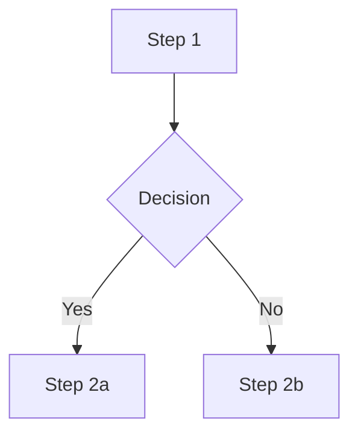

# Convert Meeting Recording → Knowledge Markdown

## Outcome

For every run, a folder `outbox/{meeting-slug}/` containing **at minimum** a cleaned transcript markdown with timestamps + speaker labels, and (when warranted) screenshots inlined at the moments they're referenced. Topic-split articles are added only on user request.

## Required Output Layout

```
outbox/{meeting-slug}/
  transcript.md             # ALWAYS produced — the canonical artifact
  screenshots/{nn}.jpg      # only if visual content adds value
  summary.md                # only if user asked to structure
  topics/{topic-slug}.md    # only if user asked to structure
```

`{meeting-slug}` is `kebab-case-topic-YYYYMMDD` derived from the meeting subject + date.

## Setup (one-time per machine)

This skill shells out to two Python scripts. They both run via [`uv`](https://docs.astral.sh/uv/), which manages each script's dependencies automatically via PEP 723 inline metadata — no project venv needed.

1. **Install `uv`:** `curl -LsSf https://astral.sh/uv/install.sh | sh`
2. **Install `ffmpeg`:** required for video probing, audio extraction, and screenshot capture.
3. **For re-transcription only:** set `OPENAI_API_KEY` (see the `transcribe` skill's Setup).

Preflight:
```bash
uv --version && ffmpeg -version | head -1
```

## Workflow

The flow has **three user-confirmation gates**. Do not skip them.

```
Inventory & probe → [GATE 1: confirm input + preprocessing plan]
  → Preprocess → Cleaned transcript (mandatory)
  → Screenshot extraction & inline linking
  → [GATE 2: ask if structuring is wanted]
  → Plan structure → [GATE 3: confirm structure plan]
  → Emit structured docs → Done
```

---

### Step 1 — Inventory & Probe

List the meeting folder. Identify each artifact's role (video, audio, VTT) and gather media metadata so the preprocessing plan is grounded in facts.

```bash
ls -la inbox/{meeting-folder}/
ffprobe -v error -show_entries format=duration,size,format_name \
  -show_entries stream=codec_type,codec_name,width,height,sample_rate \
  -of default=nw=1 inbox/{meeting-folder}/{file}
```

Record for each media file: container, codecs, duration, resolution (video), audio sample rate, file size.

For VTT files: count cues, list distinct speaker labels, and note whether labels look usable or generic ("Unknown", "Speaker 1").

### Step 2 — Gate 1: Confirm Input + Preprocessing Plan

Present to the user, in compact form:

1. **What was found** — one bullet per file with role + key metadata.
2. **How files relate** — e.g. "video and VTT are aligned; no separate audio".
3. **Quality assessment** — speaker labels OK / generic, transcript coherent / garbled, video has screen content / faces only (you can't fully judge until Step 3 probe, mark as "to verify").
4. **Proposed preprocessing**, choosing only what's actually needed:
   - Video format conversion (e.g. `.mov` → `.mp4`, re-encode unreadable codec)
   - Audio extraction (when re-transcription is needed)
   - VTT parsing to JSON (when VTT is present)
   - Re-transcription with diarization (when speaker labels are generic or VTT is missing/garbled)
5. **Proposed `{meeting-slug}`** for the output folder.

Wait for user confirmation or correction. Iterate until aligned.

### Step 3 — Preprocess

Execute only the steps confirmed in Gate 1.

**Video format conversion** (when needed):
```bash
ffmpeg -i input.mov -c:v libx264 -crf 20 -c:a aac -b:a 160k tmp/video.mp4
```

**VTT parsing** (when a usable VTT exists):
```bash
uv run --script .claude/skills/convert/scripts/parse_vtt.py \
  inbox/{meeting-folder}/meeting.vtt \
  --pretty -o tmp/transcript_parsed.json
```
Read `metadata` and `screen_references` first. Read `cues` in chunks only when needed for content analysis.

The parser is tuned for Zoom (`Speaker Name: text`). For Teams / Google Meet / non-English meetings, screen-reference detection won't work — read the VTT directly and identify speaker patterns and visual moments manually.

**Re-transcription with diarization** (when needed) — use the `transcribe` skill:
1. Ask the user up front: how many speakers, names, roles, and one or two distinguishing details to help the model attribute lines correctly. If reference audio clips for any speaker are available, collect their paths (up to 4).
2. Extract audio if not already present: `ffmpeg -i video.mp4 -vn -acodec libmp3lame -q:a 2 tmp/audio.mp3`
3. Run the bundled transcribe CLI:
   ```bash
   uv run --script .claude/skills/transcribe/scripts/transcribe_diarize.py \
     tmp/audio.mp3 \
     --model gpt-4o-transcribe-diarize \
     --response-format diarized_json \
     --out-dir tmp/transcribe/{meeting-slug}
   ```
   Add `--known-speaker "Name=path/to/sample.wav"` per known speaker (max 4) and `--language` if the language is known.

   **If transcribe exits non-zero:** read the `Error [<category>]:` line and follow the table in [`transcribe/SKILL.md` → Error handling](../transcribe/SKILL.md#error-handling). Auth (10), permission (11), and bad-request (30) errors mean the user has to act before the same command can succeed — surface the error verbatim, ask the user to fix or cancel, and **wait for their decision before retrying**. Service (20) and rate-limit (12) errors are usually transient — ask the user whether to wait + retry or cancel, then proceed accordingly. Do not silently fall back to a different model or skip re-transcription.
4. Diarized JSON has `segments[]` with `speaker` + `start` + `end` + `text` — do NOT pipe it through `parse_vtt.py`; read it directly.

**Video probe for screen content** (always run before considering screenshots):
```bash
ffmpeg -i video.mp4 -ss 30 -frames:v 1 -q:v 2 tmp/probe_frame.jpg
```
View the frame. If it shows only webcam faces or a blank screen, plan zero screenshots. If it shows UI / slides / documents, screenshots are in scope.

### Step 4 — Cleaned Transcript (Mandatory)

Always produce `outbox/{meeting-slug}/transcript.md`. This is the canonical artifact and must be a faithful, readable rendering of what was said — not a paraphrase.

Format:

```markdown
# {Meeting Title} — {YYYY-MM-DD}

**Duration:** {mm:ss} · **Participants:** {speakers} · **Source:** {original filename(s)}

---

[00:00:12] **Alice:** Opening line of the meeting, exactly as transcribed.

[00:00:24] **Bob:** Reply, with sentence punctuation cleaned up but wording preserved.

[00:01:05] **Alice:** Continued discussion…
```

Rules:
- One block per cue or per consecutive same-speaker run (merge adjacent cues from the same speaker into a single paragraph; keep the **earliest** timestamp).
- Timestamps in `[HH:MM:SS]` form, anchored to the start of the speaker's turn.
- Fix obvious transcription artifacts (stutters, duplicate words, filler-only fragments) but **do not summarize, reorder, or invent content**.
- Preserve language of the original — do not translate.
- Skip pure scheduling/greeting chatter only if it has zero substantive content; when in doubt, keep it.

### Step 5 — Screenshots & Inline Linking

Skip entirely if the Step 3 probe showed no screen content.

Otherwise, for each screen-share moment that materially aids understanding (use judgment — not every reference deserves a frame):

1. Pick the timestamp from `screen_references` (or, for non-Zoom/non-English VTTs, from your manual scan).
2. Add 2–3 seconds — speakers usually say "this" before the content is fully on screen:
   ```bash
   ffmpeg -i video.mp4 -ss {seconds+2} -frames:v 1 -q:v 2 \
     outbox/{meeting-slug}/screenshots/{nn}.jpg
   ```
3. For content that scrolls or changes (tables, multi-page docs), capture 2–3 frames at intervals.
4. Use `-q:v 2` (high quality) — these need to be readable.

Inline each screenshot **into `transcript.md`** at the matching timestamp:

```markdown
[00:14:32] **Alice:** Look at this column — that's where we record the VAT code.


*Column highlighted: `vat_code`. Note the empty rows for clients onboarded before 2024.*
```

Skip a screenshot when: the frame is just a face, the transcript text alone fully conveys it, or the content is already documented elsewhere.

### Step 6 — Gate 2: Ask About Structuring

Stop here and ask the user:

> The transcript and screenshots are ready in `outbox/{meeting-slug}/`. Do you want me to also produce a structured set of documents (summary + per-topic articles), or is the transcript enough?

If "no" → done. Report what was created (Step 9).

If "yes" → continue to Step 7.

### Step 7 — Plan Structure

Read through the transcript and identify:
- **Topics** — coherent segments worth their own article
- **Decisions** — agreements, conclusions
- **Action items** — task + owner + deadline (if mentioned)
- **Open questions** — unresolved threads
- **Pain points** and **proposals** worth surfacing

Propose a structure to the user as a short list:

```
summary.md                            — meeting overview + key decisions + action items
topics/{slug-1}.md                    — {one-line description}
topics/{slug-2}.md                    — {one-line description}
```

Note which screenshots will move into which topic article (or be referenced from both transcript and topic). Do not produce the files yet.

### Step 8 — Gate 3: Confirm and Emit

Wait for user approval (or revisions) of the proposed structure. Then produce the files.

**`summary.md`:**
```markdown
# Meeting: {Topic} — {YYYY-MM-DD}

**Participants:** {speakers} · **Duration:** {mm:ss}

## Topics Covered
1. [{Topic 1}](topics/{slug-1}.md) — one-line summary
2. [{Topic 2}](topics/{slug-2}.md) — one-line summary

## Key Decisions
- {Decision}

## Action Items
- [ ] {Task} — {owner} — {deadline if mentioned}

## Open Questions
- {Question}

## Source
- [Full transcript](transcript.md)
```

**`topics/{slug}.md`** — one per topic. Use this shape unless the topic is clearly a process description, in which case use the process variant below.

```markdown
# {Topic Title}

**Source:** [{meeting-slug}/transcript.md](../transcript.md) · {timestamp range}
**Participants quoted:** {speakers in this segment}

## Summary
{1–3 sentences}

## Details
{Narrative reconstruction grounded in the transcript. Quote sparingly when wording matters.}


*{Caption}*

## Pain points / Decisions / Proposals
- {as applicable}
```

**Process variant** — when a topic describes a workflow:

```markdown
# {Process Name}

## Overview
{Who uses it, what it does}

## Current Process
1. {Step}
2. {Step with screenshot}

   
   *{Caption}*

## Pain Points
- {…}

## Proposed Improvements
- {…}
```

**Diagrams from screen recordings** — when a screenshot shows a flow / decision tree, also reconstruct it as Mermaid in the markdown, keeping the screenshot as backup:

````markdown

*Reconstructed from `screenshots/{nn}.jpg`.*
````

### Step 9 — Report

Print a short summary of what was produced:

```
outbox/{meeting-slug}/
  transcript.md           ({n} turns, {duration})
  screenshots/            ({n} images)
  summary.md              [if structured]
  topics/                 ({n} articles) [if structured]
```

Stop. Do not run any downstream skill automatically.

---

## Decision Rules

| Situation | Decision |
|-----------|----------|
| VTT present, speaker names usable | Parse VTT, no re-transcription |
| VTT speakers generic or text garbled | Re-transcribe with diarization |
| Video unreadable / wrong container | Convert with ffmpeg before any other step |
| Probe frame shows only faces | Zero screenshots |
| Probe frame shows UI / slides / docs | Screenshots in scope, judge per moment |
| Meeting < 5 min | Even if user requests structuring, suggest skipping topic split — summary only |
| Screen shows a diagram / flowchart | Screenshot **and** Mermaid reconstruction |
| Screen shows a data table | Screenshot **and** markdown table reconstruction |
| Non-English meeting (FR/DE common in LU) | Read VTT directly; auto screen-reference detection won't fire |

## Anti-Patterns

- **Don't skip the cleaned transcript.** It is the baseline output, not optional. Even if structuring is requested, `transcript.md` is still produced.
- **Don't paraphrase the transcript.** Clean punctuation and merge same-speaker runs; never reword content.
- **Don't deposit anywhere except `outbox/{meeting-slug}/`.** No writes to `knowledge/`, no writes to `inbox/`.
- **Don't structure without explicit user approval.** Topic splits happen only after Gate 2 + Gate 3.
- **Don't screenshot everything.** Visual context must add information the transcript alone doesn't carry.
- **Don't transcribe what's already readable.** A usable VTT is the cheapest source of truth.
- **Don't fabricate screen content.** If a frame is unclear, mark it as such — never invent UI labels or numbers.
- **Don't run the next skill.** This skill stops after Step 9; the user reviews before any downstream pipeline.
