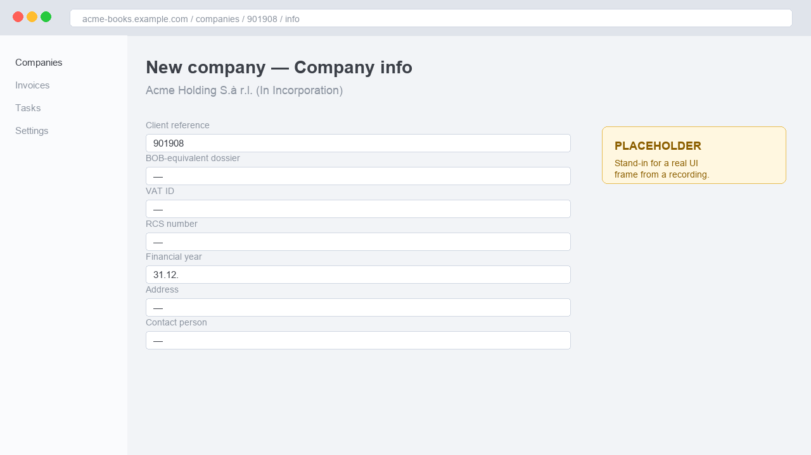
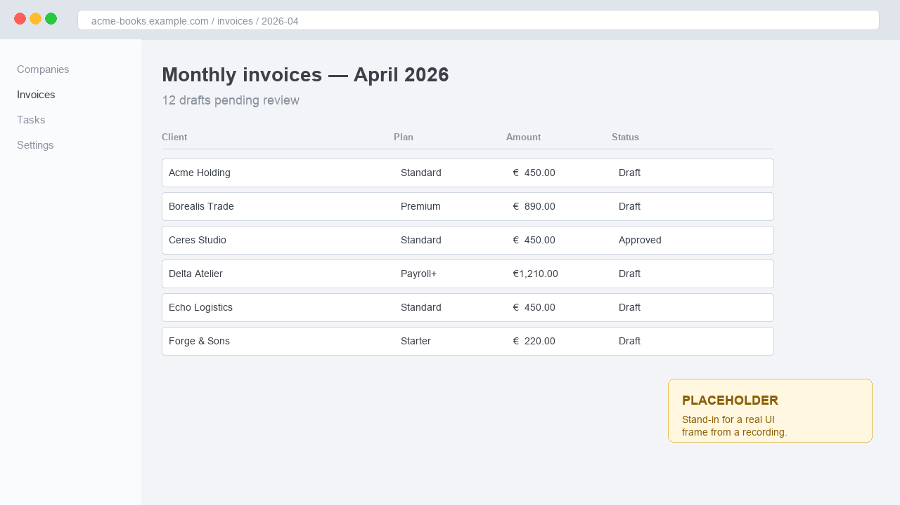

# Distill knowledge from meetings, interviews, and screen-shares

An [Agent Skill](https://agentskills.io/) that turns recorded meetings into speaker-labelled markdown transcripts, optionally with screenshots and topic-by-topic documents.

Built for knowledge handovers, interviews, screen-share walkthroughs, and voice notes — anything where the value is in what was said, not in the audio.

The point of the skill is to draw a clean line between **deterministic work** — audio normalisation, video → audio, chunking, VTT parsing, API calls, frame extraction — handled by the included scripts, and **language work** — picking the transcription path, naming speakers, judging what to repair or mark unclear, choosing which moments deserve a screenshot, and shaping the final document — done by the agent itself. Scripts move bytes; the agent decides meaning and structure.

## Install

```bash
npx skills add dimdasci/distill-knowledge
```

This drops the skill into your agent's skills directory.

Manual install: clone this repo, copy `skills/distill-knowledge/` into your agent's skills folder.

The skill follows the [Agent Skills open standard](https://agentskills.io/) — originally developed by Anthropic, now an open spec adopted by Claude Code, Gemini CLI, Cursor, OpenCode, Goose, GitHub Copilot, OpenAI Codex, and many other agents. Any compliant agent will pick it up.

## Prerequisites

| Tool | Why |
|---|---|
| [`uv`](https://docs.astral.sh/uv/) | Runs the Python scripts (PEP 723, no venv to manage) |
| `ffmpeg`, `ffprobe` | Audio normalisation, video → audio extraction, screenshot frames |
| `OPENAI_API_KEY` | Transcription via `gpt-4o-transcribe` |
| Python ≥ 3.10 | `uv` installs the right interpreter automatically |

The skill checks all of these on first run.

### How to install the tools

#### Install uv

```bash
curl -LsSf https://astral.sh/uv/install.sh | sh   # macOS, Linux
brew install uv                                    # macOS, Homebrew
pipx install uv                                    # any platform with pipx
```

Windows or alternatives: see <https://docs.astral.sh/uv/getting-started/installation/>.

#### Install ffmpeg

```bash
brew install ffmpeg                # macOS
sudo apt install ffmpeg            # Debian, Ubuntu
sudo dnf install ffmpeg            # Fedora
choco install ffmpeg               # Windows (Chocolatey)
```

`ffprobe` ships inside the same package.

#### Set the OpenAI API key

The skill picks the key up automatically from either source — no extra wiring:

- **Shell environment** — `export OPENAI_API_KEY=sk-...` in your shell rc, or set it inline before invoking the agent.
- **Project `.env`** — create a `.env` file in the directory you run the agent from (or any parent), with `OPENAI_API_KEY=sk-...` on its own line. The skill walks up the directory tree to find it.

If both are set, the shell variable wins. Never commit `.env` — keep it gitignored.

## How to use

1. Drop the recording in `inbox/`. Audio or video. If you have a `.vtt` next to it, leave it there — the skill uses it as a speaker-aligned skeleton.
2. Ask the agent in plain English what you want.
3. Answer three intake questions: language, number of speakers, topic + any proper names or specialised terms.
4. The agent emits everything under `outbox/{slug}/`. It never writes outside that folder.

The skill always asks before transcribing. If you do not answer the intake questions, it will not call the API.

## Examples

### Voice note → transcript only

> Process the voice memo I just dropped in inbox.

You get one file:

```
outbox/quick-thoughts-q3-20260420/
└── transcript.md
```

`transcript.md` has timestamped speaker turns. If there is one speaker, it is paragraphed by topic. The transcript is faithful to what was said — recoverable garble is repaired, silences are not filled.

### Process handover → topic docs with screenshots

Anonymised prompt:

> I have a recording of a process handover from Person A to Person B, in Spanish. The recording with screen-share and the VTT are in `inbox/`, prefixed `GMTYYYYMMDD-Recording`. I need documents that describe the processes as Person A presented them, but in English, split by topic with an index file. All tool explanations must be supported by clear screenshots with sequential numbering and explanatory titles. The VTT transcription is likely low quality and needs re-transcription.

You get:

```
outbox/process-handover-20260420/
├── summary.md              # index — one row per topic, links into topics/
├── transcript.md           # full transcript, faithful to the source language
├── topics/
│   ├── 01-big-picture.md
│   ├── 02-receiving-tickets.md
│   ├── 03-priority-rules.md
│   ├── 04-triage-workflow.md
│   └── ...
└── screenshots/
    ├── 01.jpg
    ├── 02.jpg
    └── ...
```

The shape above is what the agent chose for *this* prompt — it is not a template the skill enforces. The skill does not prescribe section names, file counts, or filenames. A different prompt yields a different structure: a single flat document, an FAQ, a checklist, a slide-by-slide narration, a Q&A pairing, or whatever else fits the goal. Discuss the target shape with the agent before or during processing — that is the part you have leverage over.

For the prompt above the agent landed on a `summary.md` index (who is who, the big picture, a table of topics), per-topic files in a *What it is → What you do → What you see → Things to watch out for → Source* rhythm, and screenshots numbered continuously across all topics.

## What a topic document looks like

The block below is a synthetic excerpt with placeholder screenshots. In real outputs the screenshots are frames extracted from the recording at the right timestamps. The layout below reflects one prompt's intent — yours can ask for something completely different.

---

> ### Step 5 — Triaging an incoming ticket
>
> #### What it is
>
> The triage queue is where every new customer message lands before it reaches an agent. The triager assigns priority, owner, and tags before the ticket leaves the queue.
>
> #### What you do
>
> 1. Open the help-desk → switch to the `Queue` view → filter by `status = New`.
> 2. Open the oldest unassigned ticket.
> 3. Read the customer message. Skim the customer's history in the right panel.
> 4. Set Priority (`Low / Normal / High / Urgent`) and at least one Tag — without a tag the SLA timer is hidden.
> 5. If the issue matches a known engineering bug, fill `Linked issue` so the ticket auto-routes to the right team.
> 6. Click `Assign` and pick the agent. Save.
>
> #### What you see
>
> 
> **Screenshot 12 — Ticket detail view, TKT-4821.** Header *"TKT-4821 — Cannot export report to CSV"*; status pills below: `Open · High · Billing team`. Form fields top to bottom: Subject (`Cannot export report to CSV`), Customer (`Lina Park — Borealis Studio`), Priority (`High`), Status (`Open`), Assignee (empty), Linked issue (empty), Tags (empty). Left sidebar: `Inbox | Queue | Customers | Reports | Settings`.
>
> 
> **Screenshot 13 — Triage queue view.** Header *"Triage queue — 24 unassigned"*, filter line *"status = New · sort by oldest"*. Table columns: ID, Subject, Customer, Priority, Status. Rows visible: TKT-4821 (Cannot export report to CSV, Borealis Studio, High, New), TKT-4822 (2FA email not arriving, Ceres Logistics, Urgent, New), TKT-4823 (Wrong totals on dashboard, Delta Atelier, Normal, New), TKT-4824 (Bulk import stuck at 30%, Echo Robotics, High, New), TKT-4825 (How do I invite a colleague?, Forge & Sons, Low, New), TKT-4826 (API key rotated unexpectedly, Helix Foods, Urgent, New).
>
> #### Things to watch out for
>
> - Tickets with no Tags are hidden from the SLA timer. Always set at least one tag before saving.
> - The "Internal note" toggle in the reply box defaults to OFF — double-check before pasting customer-facing text.
>
> #### Source
>
> Transcript: parts 34, 35, 36 (timestamps 46:30–52:30).

---

## Repo layout

| Path | What it is |
|---|---|
| `skills/distill-knowledge/` | The skill itself — what `npx skills add` installs |
| `inbox/` | Drop recordings here |
| `outbox/` | Generated transcripts and topic docs |
| `tmp/` | Preprocessing intermediates (chunks, manifests). Safe to delete. |
| `eval/` | Trigger-evaluation harness — checks that the skill activates on the right prompts |
| `docs/assets/` | Placeholder images used in this README |

The published GitHub repo is named `distill-knowledge` to match the skill (skills.sh convention). The local working dir may differ.

## Two transcription paths

| Input | Path | Notes |
|---|---|---|
| Recording with a good VTT | Render the VTT directly | Cheapest, most accurate. No API call. |
| Recording with a garbled VTT | VTT-aligned re-transcription | VTT gives speaker labels and turn timestamps; `gpt-4o-transcribe` gives clean text; the agent aligns. |
| Recording, no VTT, one speaker | Direct transcription | `gpt-4o-transcribe` on the prepared audio. |
| Recording, no VTT, many speakers | Diarise fallback | `gpt-4o-transcribe-diarize` in 8-minute chunks. Quality is unstable — the skill warns you. |

The skill picks the path at Gate 1 of the workflow and asks you to confirm before spending API budget.

## Development checks

```bash
make quality          # format check + lint + syntax + tests
make format           # apply formatter
make install-hooks    # enable commit-time checks
```

CI runs the same quality checks in `.github/workflows/python-quality.yml`.

## License

MIT — see [LICENSE](LICENSE).
