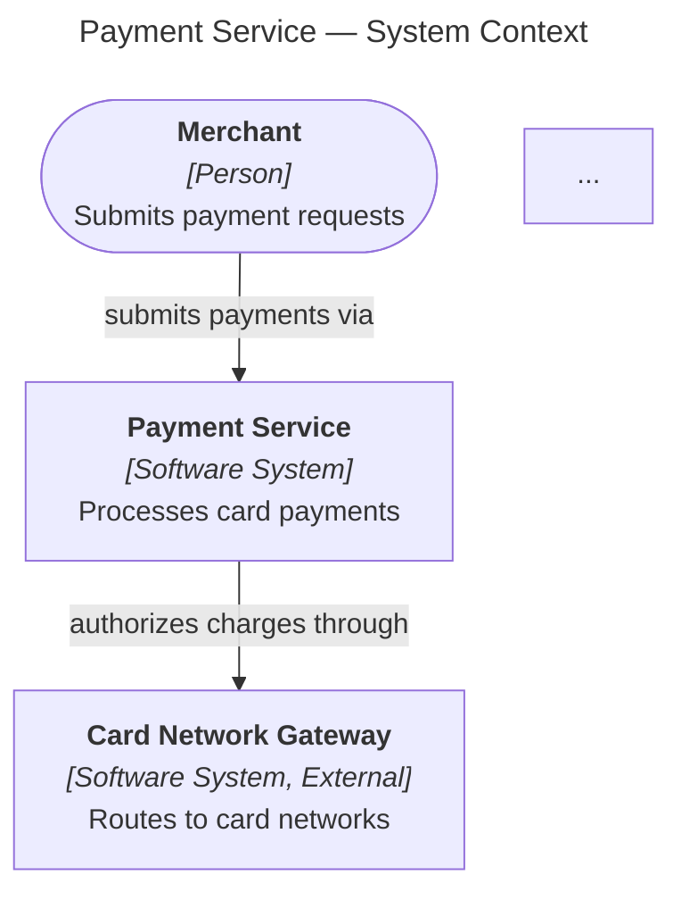

# Solution Architecture Skills

A collection of [Agent Skills](https://agentskills.io/) that automate solution architecture tasks — from capturing knowledge in meetings to producing architecture diagrams.

Built for architects and engineering teams who want agents to apply domain methodology correctly, not just generate plausible output.

## Skills

| Skill | What it does | Status |
|---|---|---|
| [`distill-knowledge`](skills/distill-knowledge/) | Turns recorded meetings, interviews, and screen-shares into speaker-labeled transcripts and structured topic documents | Stable (v1.0) |
| [`c4-diagram`](skills/c4-diagram/) | Produces C4 architecture diagrams in Mermaid notation (flowchart + subgraphs, validated syntax) | Initial (v0.1) |

## Install

```bash
# Install a single skill
npx skills add dimdasci/distill-knowledge
npx skills add dimdasci/distill-knowledge --skill c4-diagram
```

Manual install: clone this repo, copy the desired `skills/<name>/` directory into your agent's skills folder.

Skills follow the [Agent Skills open standard](https://agentskills.io/) — originally developed by Anthropic, now adopted by Claude Code, Gemini CLI, Cursor, OpenCode, Goose, GitHub Copilot, OpenAI Codex, and many other agents. Any compliant agent will pick them up.

## Prerequisites

Each skill declares its own requirements. At a glance:

| Skill | Needs |
|---|---|
| `distill-knowledge` | `uv`, `ffmpeg`, `ffprobe`, Python ≥3.10, `OPENAI_API_KEY` |
| `c4-diagram` | Node.js ≥18 (for Mermaid syntax validation) |

See individual skill `SKILL.md` files for full setup details.

---

## Skill: distill-knowledge

Converts audio/video recordings into knowledge artifacts. Draws a clean line between **deterministic work** (audio normalization, chunking, API calls, frame extraction) handled by scripts, and **language work** (transcription path selection, speaker naming, fidelity judgment, document shaping) done by the agent.

### Quick example

> Process the voice memo I just dropped in inbox.

```
outbox/quick-thoughts-q3-20260420/
└── transcript.md
```

### Capabilities

- VTT-aligned retranscription (speaker labels from VTT + clean text from API)
- Direct single-speaker transcription
- Multi-speaker diarization (8-min chunks, quality warning)
- Screenshot extraction from screen-share recordings
- Structured topic documents with inline screenshots

### How to use

1. Drop the recording in `inbox/`
2. Ask the agent what you want
3. Answer three intake questions: language, number of speakers, topic + proper names
4. Output appears under `outbox/{slug}/`

---

## Skill: c4-diagram

Produces C4 software architecture diagrams rendered as Mermaid code. Applies Simon Brown's C4 methodology correctly — abstraction-first thinking, proper scoping, notation rules — and uses stable Mermaid syntax (flowchart + subgraphs, not the experimental C4* diagram types that break across versions).

### Quick example

> Create a system context diagram for our payment service.



### Capabilities

- All C4 diagram types: system context, container, component, deployment, dynamic, landscape
- Validated Mermaid syntax (mermaid.parse with loose security)
- Anti-pattern detection (banned C4* keywords, hub-and-spoke bus, mixed levels)
- Self-check against C4 notation rules
- Complete working templates for all diagram types

### How to use

1. Tell the agent what system you want to diagram and who will read it
2. The agent identifies C4 abstractions, selects diagram type, confirms with you
3. Diagram produced, validated, and delivered as a Mermaid code block

---

## Repo Layout

| Path | What it is |
|---|---|
| `skills/distill-knowledge/` | Distill Knowledge skill — transcription and topic docs |
| `skills/c4-diagram/` | C4 Diagram skill — architecture diagrams in Mermaid |
| `inbox/` | Drop recordings here (distill-knowledge) |
| `outbox/` | Generated artifacts |
| `tmp/` | Processing intermediates (safe to delete) |
| `eval/` | Trigger-evaluation harness |
| `docs/assets/` | Images used in documentation |

## Design Principles

All skills in this repo share a philosophy:

1. **Methodology over syntax** — skills encode *how to think about the task* (C4 abstractions, transcription fidelity rules), not just tool syntax.
2. **Scripts for I/O, agents for judgment** — deterministic work (file processing, validation, API calls) lives in scripts; decisions about meaning and structure are the agent's job.
3. **Progressive disclosure** — SKILL.md stays compact; heavy references load on demand to respect context budgets.
4. **Validation loops** — every skill validates its output before delivering (syntax check, self-check checklists).
5. **Anti-pattern catalogs** — encode known mistakes so agents avoid them without trial and error.

## Development

```bash
make quality          # format check + lint + syntax + tests (distill-knowledge)
make format           # apply formatter
make install-hooks    # enable commit-time checks
```

For c4-diagram validation:
```bash
cd skills/c4-diagram/scripts && npm install
node validate_mermaid.mjs --strict ../../assets/templates/context.mmd
```

## License

MIT — see [LICENSE](LICENSE).
