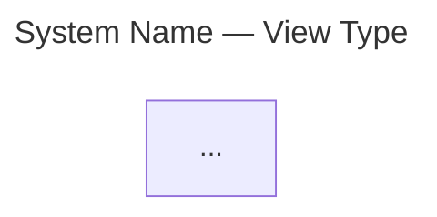

# C4 Architecture Diagrams → Mermaid

Emit valid Mermaid `flowchart` code blocks that follow C4 methodology. Never use experimental `C4Context`/`C4Container`/`C4Component`/`C4Deployment` syntax — it breaks across Mermaid versions.

References (load on demand): [abstractions](references/abstractions.md) · [diagram selection](references/diagram-selection.md) · [anti-patterns](references/anti-patterns.md) · [mermaid gotchas](references/mermaid-gotchas.md) · templates: [context](assets/templates/context.mmd) · [container](assets/templates/container.mmd) · [component](assets/templates/component.mmd) · [deployment](assets/templates/deployment.mmd) · [dynamic](assets/templates/dynamic.mmd) · [landscape](assets/templates/landscape.mmd)

Validation: `node scripts/validate_mermaid.mjs <file>`. On first use run `npm install` in `scripts/`.

---

## Rendering Primitives

### Node label formula

```
["<b>Name</b><br/><i>[Stereotype: Technology]</i><br/>One-line responsibility"]
```

### Shapes → C4 element types

| C4 Element | Shape | Example |
|---|---|---|
| Person | `(["..."])` | `User(["<b>User</b><br/><i>[Person]</i><br/>Uses the system"])` |
| Software System | `["..."]` | `IBS["<b>IBS</b><br/><i>[Software System]</i><br/>Online banking"]` |
| Container | `["..."]` | `API["<b>API</b><br/><i>[Container: Go]</i><br/>Serves REST endpoints"]` |
| Component | `["..."]` | `Auth["<b>Auth</b><br/><i>[Component: Spring Bean]</i><br/>Handles login"]` |
| Database | `[("...")]` | `DB[("<b>DB</b><br/><i>[Container: PostgreSQL]</i><br/>Stores accounts")]` |
| External system | `["..."]:::external` | `Mail["<b>Mailgun</b><br/><i>[External System]</i><br/>Sends emails"]:::external` |

### Boundaries = subgraphs

```mermaid
subgraph systemName ["System Name — [Software System]"]
  direction TB
  Container1["..."]
  Container2["..."]
end
```

Nest subgraphs for deployment nodes, trust boundaries, or container internals.

### Edges

| Style | Syntax | Use for |
|---|---|---|
| Solid | `-->` | Runtime interaction |
| Dashed | `.->` | Static dependency / ownership / non-runtime |
| Bidirectional | `<-->` | Only when both directions are semantically meaningful |

Label every edge with **purpose**, not protocol:
```
A -- "sends commands to" --> B
A -. "reads config from" .-> C
```

Protocol belongs one level down (container edges show tech on container diagrams, not on context diagrams).

### Title (mandatory)



### Legend (mandatory on structural diagrams)

```mermaid
subgraph Legend["Legend"]
  direction LR
  LP(["Person"]):::person
  LS["Internal System"]:::system
  LE["External System"]:::external
  LP ~~~ LS ~~~ LE
end

classDef person fill:#08427b,color:#fff,stroke:#052e56
classDef system fill:#1168bd,color:#fff,stroke:#0b4884
classDef external fill:#999999,color:#fff,stroke:#6b6b6b
```

Adapt legend entries to match what appears in the diagram. Use `~~~` (invisible link) for layout.

### Colors

| Class | Use for | Default |
|---|---|---|
| `person` | People / actors | `#08427b` dark blue |
| `system` | Internal systems / containers | `#1168bd` blue |
| `external` | External systems / services | `#999999` grey |
| `container` | Containers (when distinguishing from system) | `#438dd5` lighter blue |
| `component` | Components | `#85bbf0` lightest blue |
| `database` | Data stores | `#438dd5` with cylinder shape |

Colors are not prescribed by C4 — adapt to context. Be consistent within and across diagrams.

---

## Workflow

### Step 0 — Intake

Ask:

> 1. What system (or landscape) are we diagramming?
> 2. Who is the audience? (everyone / technical / architects+devs)
> 3. What's the goal? (communicate to stakeholders / onboard devs / design review / document current state)
> 4. Do you already have named abstractions (systems, containers, components) or should we identify them together?

Sensible defaults if user skips fields. Proceed once enough context exists.

### Step 1 — Identify Abstractions

Before drawing anything, map the architecture to C4 vocabulary:

- **Software system** — what a single team owns. The team boundary = system boundary.
- **Container** — a running application or data store. Not Docker (though often maps to Docker).
- **Component** — a grouping of related code behind an interface, inside a container. Not separately deployable.

Load [references/abstractions.md](references/abstractions.md) for:
- Microservice decision: same team → containers; different team → separate system
- Queues/topics: model as individual containers (data stores), not a single "message bus"
- Shared libraries: not containers — show as component copies with color coding

### Step 2 — Select Diagram Type

| Audience | Goal | Diagram type |
|---|---|---|
| Everyone | Big picture | System Context |
| Everyone | Enterprise overview | System Landscape |
| Technical | Architecture shape | Container |
| Architects + devs | Internal structure | Component |
| Technical | Runtime behavior | Dynamic (sequence) |
| Ops / infra | Where it runs | Deployment |

Load [references/diagram-selection.md](references/diagram-selection.md) for detail. Confirm choice with user.

Most teams need only System Context + Container. Don't over-diagram.

### Step 3 — Produce Diagram

1. Load the template for the chosen type from `assets/templates/`
2. Apply the rendering primitives from this file
3. Use `flowchart TB` for hierarchical views, `flowchart LR` for pipelines/flows
4. Keep under 25 nodes — split into focused sub-views if larger
5. Use `click NodeID "url" "tooltip"` for drill-down links between diagrams

### Step 4 — Validate Syntax

```bash
node scripts/validate_mermaid.mjs diagram.mmd
```

Or pipe directly:
```bash
echo '<mermaid code>' | node scripts/validate_mermaid.mjs --strict -
```

Fix errors. Re-run until `✓ Valid`. Use `--strict` to also reject banned C4* keywords.

### Step 5 — Self-Check (notation quality)

- [ ] Title present (YAML frontmatter in the mermaid block)
- [ ] Every element has `[Stereotype]` in label
- [ ] Every element has one-line responsibility description
- [ ] Every container/component has technology stated
- [ ] Every edge is labeled with purpose
- [ ] Every edge is unidirectional (bidirectional only when both directions meaningful)
- [ ] Legend subgraph present (structural diagrams)
- [ ] Diagram has ≤ 25 nodes
- [ ] No `C4Context` / `C4Container` / `C4Component` / `C4Deployment` keywords
- [ ] Labels with HTML or special chars are quoted

---

## Hard Rules

1. **NEVER** use `C4Context`, `C4Container`, `C4Component`, `C4Deployment`, `C4Dynamic` — experimental, breaks across versions.
2. **ALWAYS** use `flowchart` + `subgraph` for structural diagrams, `sequenceDiagram` for temporal interactions.
3. **ALWAYS** quote labels containing HTML (`<b>`, `<i>`, `<br/>`) or special chars.
4. **ALWAYS** include Legend subgraph in structural diagrams.
5. **ALWAYS** validate with `scripts/validate_mermaid.mjs` before delivering.
6. **Purpose on edges**, not protocol. Protocol belongs one level down.
7. **Abstraction labels** (`[Person]`, `[Software System]`, `[Container: Tech]`, `[Component: Tech]`) are mandatory — they tell the reader what level they are looking at.

---

## Anti-Patterns (top 5)

1. **Hub-and-spoke message bus** — modeling RabbitMQ/Kafka as one container. Model each queue/topic as its own container instead. See [anti-patterns](references/anti-patterns.md).

2. **Microservice as component** — a microservice is a container (or group of containers), never a component. Components are not separately deployable.

3. **Mixing abstraction levels** — a context diagram showing containers, or a container diagram showing components from other systems. Each diagram has one scope.

4. **Unlabeled edges** — every arrow must say what it does. "Uses" is too vague. Be specific: "sends payment requests to", "reads user profiles from".

5. **Missing boundaries** — if your container diagram doesn't have a subgraph showing the system boundary, the reader can't tell what's inside vs. outside.

Full catalog: [references/anti-patterns.md](references/anti-patterns.md)

---

## Mermaid Syntax Pitfalls

| Error | Fix |
|---|---|
| Unescaped `()[]` in labels | Quote entire label: `["label with (parens)"]` |
| Missing quotes on HTML labels | Always: `["<b>Name</b><br/>desc"]` |
| `subgraph` without `end` | Every `subgraph` needs matching `end` |
| Empty subgraph | Must contain at least one node |
| HTML stripped at render time | Renderer needs `securityLevel: 'loose'` — note in output |

Full list: [references/mermaid-gotchas.md](references/mermaid-gotchas.md)
