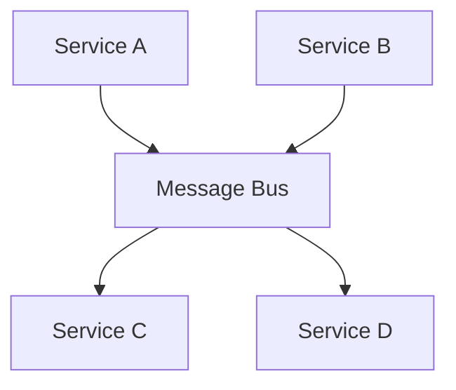
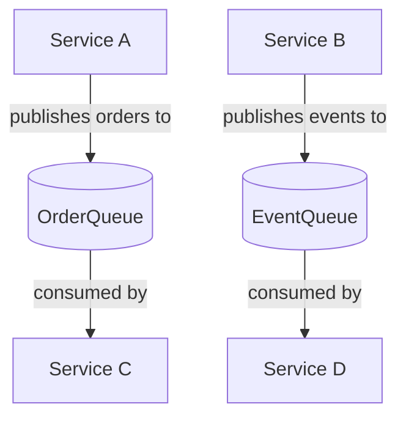

# Anti-Patterns — Reference

Load when reviewing diagram quality or when something "feels wrong."

---

## C4 Methodology Errors

### 1. Hub-and-Spoke Message Bus

**Symptom:** A single "Message Bus" or "RabbitMQ" container in the center with arrows from/to every service.

**Problem:** Obscures real point-to-point coupling. You can't tell which services actually depend on each other.

**Fix:** Model each queue/topic as its own container. Or use implicit notation: direct arrows labeled "via OrderQueue".

---

### 2. Microservice as Component

**Symptom:** A microservice modeled as a C4 component, with its API and database as sub-elements.

**Problem:** Components are not separately deployable. A microservice IS deployable — it's a container (or group of containers).

**Fix:** Model the microservice's API as a container, its database as a container. Group them visually with a subgraph or color coding.

---

### 3. Mixing Abstraction Levels

**Symptom:**
- A system context diagram showing containers from inside the system
- A container diagram showing components from a different system
- External system internals visible on your container diagram

**Problem:** Each diagram has one scope. Mixing levels confuses the reader about what is inside vs. outside, what is deployable vs. logical.

**Fix:**
- Context diagram: only systems and people
- Container diagram: only containers inside YOUR system + external systems as black boxes
- Component diagram: only components inside ONE container

---

### 4. Unlabeled or Vaguely Labeled Edges

**Symptom:** Arrows with "uses", "calls", "depends on", or no label at all.

**Problem:** The reader doesn't know what the relationship means. "Uses" tells you nothing.

**Fix:** Be specific about purpose: "sends payment requests to", "reads user profiles from", "notifies about order status changes".

---

### 5. Missing System Boundary

**Symptom:** Container diagram with all containers floating — no visual indication of what's inside the system vs. external.

**Problem:** Reader can't tell the team's ownership boundary.

**Fix:** Wrap your containers in a `subgraph` labeled with the system name and `[Software System]`.

---

### 6. Docker Confusion

**Symptom:** Treating Docker as the definition of "container." Or adding Docker as a C4 container.

**Problem:** C4 containers are an abstraction — applications and data stores. Docker is a deployment mechanism. A Spring Boot app is the C4 container; Docker is where it runs (deployment diagram).

**Fix:** Separate static structure (container diagram) from deployment (deployment diagram). The C4 container = the app; Docker = the deployment node it runs in.

---

### 7. Adding New Abstraction Levels

**Symptom:** Inventing "subsystem", "module", "service layer" as new C4 levels between system and container, or between container and component.

**Problem:** Defining abstractions is extremely hard. Custom abstractions quickly become vague and team-specific, degrading back to ad hoc boxes.

**Fix:** Use the four fixed C4 abstractions. Express layers, subsystems, bounded contexts as **organizational constructs** — subgraph boundaries, color coding, labels — overlaid on the existing abstractions.

---

### 8. Architecture Decisions in Diagrams

**Symptom:** Trying to show WHY the architecture is this way in the diagram itself.

**Problem:** Category error. C4 diagrams show the *outcome* of decisions (what was decided), not the rationale (why).

**Fix:** Decisions belong in ADRs (Architecture Decision Records). Keep traceability between diagrams and ADRs, but separate the artifacts.

---

### 9. Deployment on Container Diagrams

**Symptom:** Container diagrams showing load balancers, DNS, replication, auto-scaling groups.

**Problem:** Container diagrams show logical architecture. Deployment concerns go in deployment diagrams.

**Fix:** One container diagram (logical shape) + one deployment diagram per environment (physical mapping).

---

### 10. Shared Database as Neutral Territory

**Symptom:** A shared database floating between two systems with no clear ownership.

**Problem:** Shared databases are coupling. Someone owns the schema.

**Fix:** Assign ownership. The team that owns the schema owns the container. If truly shared and unresolvable, model an intermediate system that owns it.

---

## Notation Errors

### 11. No Title

Every diagram needs: `"[Diagram Type] for [Scope]"` — e.g., "Container Diagram for Internet Banking System".

### 12. No Legend

If you use colors, shapes, or line styles to convey meaning, the diagram needs a legend explaining them.

### 13. Missing Element Metadata

Every element needs:
- **Name** (bold)
- **Type** (`[Person]`, `[Software System]`, `[Container: Technology]`, `[Component: Technology]`)
- **One-line responsibility** (what it does)

Without the type label, readers can't distinguish containers from components from systems.

### 14. Inconsistent Naming Across Diagrams

If it's called "Payment Service" on the context diagram, it must be "Payment Service" on the container diagram. Same names, always. This is where modeling (one definition, multiple views) beats diagramming (copy-paste between separate files).

### 15. More Than ~25 Nodes

At 25+ nodes, a diagram becomes unreadable. Split into focused sub-views:
- Per-service focused container diagrams
- Per-container component diagrams
- Per-domain landscape slices
