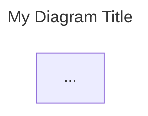

# Mermaid Syntax Gotchas — Reference

Load when validation fails or output renders incorrectly.

---

## Critical: Security Level

If labels contain HTML (`<b>`, `<i>`, `<br/>`), the renderer **must** use:

```javascript
mermaid.initialize({ securityLevel: 'loose' });
```

In `strict` mode (default in many renderers), HTML entities are stripped. The syntax is valid but the output looks garbled — `<b>` disappears, `<br/>` becomes literal text.

**Action for output:** When delivering diagrams, note that renderers must use `securityLevel: 'loose'` for HTML labels to display correctly. GitHub Markdown preview strips HTML from Mermaid — diagrams render correctly in tools like Mermaid Live Editor, documentation sites, or rendered markdown with loose security.

---

## Common Syntax Errors

| Error | Symptom | Fix |
|---|---|---|
| Unescaped special chars in label | Parse error pointing at `(`, `)`, `[`, `]` | Wrap entire label in quotes: `["label with (parens)"]` |
| Missing quotes on HTML labels | Parse error or mangled output | Always quote: `["<b>Name</b><br/>desc"]` |
| Comma in label without quotes | Unexpected token error | Quote the label |
| `subgraph` without `end` | "Parse error" at end of file or next statement | Every `subgraph` needs matching `end` |
| Empty subgraph | Silently dropped or parse error | Always include at least one node inside |
| Node ID reuse across subgraphs | Second occurrence is silently moved | Use unique IDs; if same element appears in two places, use different IDs with same label |
| `direction` placement | Layout doesn't respond | `direction LR` must be the first line inside `subgraph`, before any nodes |
| Arrow to subgraph | Inconsistent rendering | Arrow to a specific node inside the subgraph, not the subgraph itself |
| Colons in label text | Mermaid interprets as node type | Quote the label or use HTML entity `&#58;` |
| Pipe `|` in label | Interpreted as edge label syntax | Quote or use HTML entity `&#124;` |
| Parentheses in node ID | Treated as shape delimiter | Keep node IDs alphanumeric + underscore only |

---

## Label Quoting Rules

**Always quote when the label contains any of:**
- HTML tags: `<b>`, `<i>`, `<br/>`
- Parentheses: `(`, `)`
- Brackets: `[`, `]`
- Commas: `,`
- Colons: `:`
- Pipes: `|`
- Quotes within: use the other quote type or HTML entity

**Safe unquoted:** pure alphanumeric text without special characters.

**Rule of thumb:** always quote. There is no penalty for quoting a simple label.

---

## Subgraph Gotchas

```mermaid
%% CORRECT: direction first, nodes after
subgraph MySystem ["My System — [Software System]"]
  direction TB
  A["Node A"]
  B["Node B"]
end

%% WRONG: node before direction — layout may not apply
subgraph MySystem ["My System"]
  A["Node A"]
  direction TB
  B["Node B"]
end
```

- Subgraphs can nest (useful for deployment nodes)
- Subgraph labels follow same quoting rules as node labels
- A subgraph with no nodes inside may be silently dropped
- You cannot draw an edge directly TO a subgraph in all renderers — draw to a node inside it

---

## Edge Label Gotchas

```mermaid
%% CORRECT: label in quotes on the edge
A -- "sends requests to" --> B

%% ALSO CORRECT: label between pipes (works but less readable with long text)
A -->|"sends requests to"| B

%% WRONG: unquoted label with special chars
A -- sends (HTTP) requests --> B
```

- Always quote edge labels
- Long labels: use `<br/>` for line breaks within the label
- Edge labels cannot contain `--` or `-->` (Mermaid interprets these as arrow syntax)

---

## classDef and Styling

```mermaid
%% Define at bottom of diagram for readability
classDef person fill:#08427b,color:#fff,stroke:#052e56
classDef system fill:#1168bd,color:#fff,stroke:#0b4884
classDef external fill:#999999,color:#fff,stroke:#6b6b6b

%% Apply inline
Node["Label"]:::person

%% Or apply separately
class Node1,Node2 person
```

- `classDef` can appear anywhere in the diagram (top, middle, bottom)
- Place at bottom for readability — after all nodes and edges
- `:::className` applies inline when defining the node
- `class NodeID className` applies separately (useful for multiple nodes)

---

## Frontmatter Title



- The `---` YAML frontmatter block must be the very first thing in the Mermaid code
- Only `title` is commonly supported
- Some renderers may ignore it — include the title anyway for documentation value

---

## Banned Keywords

These Mermaid diagram types are **experimental and unreliable** across versions:

- `C4Context`
- `C4Container`
- `C4Component`
- `C4Deployment`
- `C4Dynamic`

If you see these in existing diagrams, rewrite using `flowchart` + subgraphs.

---

## Diagram Type Stability

| Type | Stability | Notes |
|---|---|---|
| `flowchart` | ✅ Stable | Primary choice for all C4 structural diagrams |
| `sequenceDiagram` | ✅ Stable | Use for dynamic/interaction views |
| `stateDiagram-v2` | ✅ Stable | Use for state machines |
| `classDiagram` | ✅ Stable | Use only for code-level (C4 level 4) |
| `C4Context` etc. | ❌ Experimental | NEVER use |
| `mindmap` | ⚠️ Unstable | Layout changes between versions |
| `timeline` | ⚠️ New | Less battle-tested |
| `zenuml` | ❌ Experimental | Avoid |

---

## Layout Hints

- `flowchart TB` — top-to-bottom (best for hierarchical C4 views)
- `flowchart LR` — left-to-right (for pipeline/flow views)
- `~~~` — invisible link for layout hints without visible edges
- Mermaid's auto-layout (dagre/elk) is non-deterministic — don't rely on exact positioning
- Keep diagrams under ~25 nodes for readability
- `direction` inside subgraph is independent of parent flowchart direction

---

## Click / Drill-Down

```mermaid
click NodeID "url" "tooltip" _blank
```

Use for linking C4 levels: a container node on the context diagram links to its container diagram. A container on the container diagram links to its component diagram.

---

## Rendering Environment Notes

| Environment | HTML labels | Notes |
|---|---|---|
| Mermaid Live Editor | ✅ Works | `securityLevel: 'loose'` by default |
| GitHub Markdown | ❌ Stripped | GitHub uses `strict` — HTML in labels won't render |
| GitLab Markdown | ✅ Works | Supports loose security |
| Documentation sites (Docusaurus, MkDocs) | ✅ Configurable | Set loose in mermaid config |
| VS Code preview | ✅ Configurable | Depends on extension settings |

**If targeting GitHub:** avoid HTML in labels; use plain text with `\n` line breaks or accept single-line labels. Or provide both an `.mmd` source file and a rendered `.svg`.
