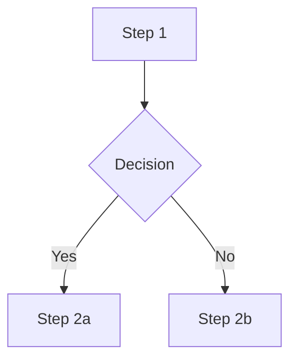

# Output templates and step details

Markdown shapes the `convert` skill emits + per-step detail that doesn't need to live in SKILL.md. Read the section matching the file or step you're working on.

## Step 1 — Inventory & probe (full commands)

```bash
ls -la inbox/{meeting-folder}/
ffprobe -v error -show_entries format=duration,size,format_name \
  -show_entries stream=codec_type,codec_name,width,height,sample_rate \
  -of default=nw=1 inbox/{meeting-folder}/{file}
```

For VTTs: count cues, list distinct speaker labels, note whether labels look usable or generic ("Unknown", "Speaker 1").

## Step 2 — Gate 1 prompt content

Present compactly: (1) what was found — one bullet per file, role + key metadata; (2) how files relate (e.g. "video and VTT are aligned; no separate audio"); (3) quality assessment (speaker labels OK / generic, transcript coherent / garbled, screen content "to verify" until Step 3); (4) proposed preprocessing (only what's needed) — video format conversion, audio extraction, VTT parsing, re-transcription with diarization; (5) proposed `{meeting-slug}`. Iterate to alignment.

## Step 3 — Preprocessing commands

**Video format conversion:**
```bash
ffmpeg -i input.mov -c:v libx264 -crf 20 -c:a aac -b:a 160k tmp/video.mp4
```

**VTT parsing** (Zoom-tuned `Speaker Name: text`):
```bash
uv run --script scripts/parse_vtt.py \
  inbox/{meeting-folder}/meeting.vtt --pretty -o tmp/transcript_parsed.json
```
Read `metadata` + `screen_references` first; `cues` in chunks. Teams / Google Meet / non-English: detection won't fire — read VTT directly.

**Re-transcription with diarization:**
1. Intake answers from Step 0 provide: language, speaker count, topic, terms. Collect up to 4 reference-clip paths if available.
2. Extract audio if needed: `ffmpeg -i video.mp4 -vn -acodec libmp3lame -q:a 2 tmp/audio.mp3`.
3. Run:
   ```bash
   uv run --script scripts/transcribe_diarize.py \
     tmp/audio.mp3 \
     --model gpt-4o-transcribe-diarize \
     --response-format diarized_json \
     --language {lang from intake} \
     --out-dir tmp/transcribe/{meeting-slug}
   ```
   Add `--known-speaker "Name=path/to/sample.wav"` per known speaker (max 4).
4. Diarized JSON has `segments[]` with `speaker`/`start`/`end`/`text` — do NOT pipe through `parse_vtt.py`.

**Speaker labelling + cleaned transcript (after diarization):**
1. Show speaker samples:
   ```bash
   uv run --script scripts/render_transcript.py \
     tmp/transcribe/{meeting-slug}/audio.transcript.json --samples
   ```
2. User names speakers (or confirms raw labels).
3. Render final transcript:
   ```bash
   uv run --script scripts/render_transcript.py \
     tmp/transcribe/{meeting-slug}/audio.transcript.json \
     --speakers "A=Name1,B=Name2" \
     --source "inbox/{original-file}" \
     --model "gpt-4o-transcribe-diarize" \
     --language "{lang}" \
     --topic "{topic from intake}" \
     --terms "{terms from intake}" \
     --out outbox/{meeting-slug}/transcript.md
   ```

**Probe a frame for screen content:**
```bash
ffmpeg -i video.mp4 -ss 30 -frames:v 1 -q:v 2 tmp/probe_frame.jpg
```
Faces / blank → zero screenshots. UI / slides / docs → screenshots in scope.

## Step 4 — `transcript.md` shape

Mandatory artifact. Faithful, readable rendering of speech — never paraphrase.

```markdown
# {Meeting Title} — {YYYY-MM-DD}

**Duration:** {mm:ss} · **Participants:** {speakers} · **Source:** {original filename(s)}

---

[00:00:12] **Alice:** Opening line of the meeting, exactly as transcribed.

[00:00:24] **Bob:** Reply, with sentence punctuation cleaned up but wording preserved.

[00:01:05] **Alice:** Continued discussion…
```

Rules:
- One block per cue or per consecutive same-speaker run (merge adjacent cues from the same speaker into a single paragraph; keep the **earliest** timestamp).
- Timestamps in `[HH:MM:SS]` form, anchored to the start of the speaker's turn.
- Fix obvious transcription artifacts (stutters, duplicate words, filler-only fragments) but **do not summarize, reorder, or invent content**.
- Preserve language of the original — do not translate.
- Skip pure scheduling/greeting chatter only if it has zero substantive content; when in doubt, keep it.

## Step 5 — Screenshots & inline-link shape

Per screen-share moment that materially aids understanding (judgment call — not every reference deserves a frame):
1. Take timestamp from `screen_references` (or manual scan for non-Zoom/non-English).
2. Add 2–3 s — speakers say "this" before content fully renders:
   ```bash
   ffmpeg -i video.mp4 -ss {seconds+2} -frames:v 1 -q:v 2 \
     outbox/{meeting-slug}/screenshots/{nn}.jpg
   ```
3. Scrolling / multi-page content: capture 2–3 frames at intervals.
4. Use `-q:v 2` (high quality) — must stay readable when reader zooms.

Inline into `transcript.md` at the matching cue:

```markdown
[00:14:32] **Alice:** Look at this column — that's where we record the VAT code.


*Column highlighted: `vat_code`. Note the empty rows for clients onboarded before 2024.*
```

Skip a screenshot when the frame is just a face, the transcript text alone fully conveys it, or the content is documented elsewhere.

## Step 6 — Gate 2 prompt (verbatim)

> The transcript and screenshots are ready in `outbox/{meeting-slug}/`. Do you want me to also produce a structured set of documents (summary + per-topic articles), or is the transcript enough?

"no" → Step 9. "yes" → Step 7.

## Step 7 — Plan structure

Read the transcript; identify **topics** (coherent segments worth their own article), **decisions**, **action items** (task + owner + deadline), **open questions**, **pain points** + **proposals**. Propose a short list:

```
summary.md                            — meeting overview + key decisions + action items
topics/{slug-1}.md                    — {one-line description}
topics/{slug-2}.md                    — {one-line description}
```

Note which screenshots move into which topic article (or are referenced from both). Do not produce files yet.

## Step 8 — Emitted files

### `summary.md`

```markdown
# Meeting: {Topic} — {YYYY-MM-DD}

**Participants:** {speakers} · **Duration:** {mm:ss}

## Topics Covered
1. [{Topic 1}](topics/{slug-1}.md) — one-line summary
2. [{Topic 2}](topics/{slug-2}.md) — one-line summary

## Key Decisions
- {Decision}

## Action Items
- [ ] {Task} — {owner} — {deadline if mentioned}

## Open Questions
- {Question}

## Source
- [Full transcript](transcript.md)
```

### `topics/{slug}.md` — default shape

One per topic. Use this shape unless the topic is clearly a process description.

```markdown
# {Topic Title}

**Source:** [{meeting-slug}/transcript.md](../transcript.md) · {timestamp range}
**Participants quoted:** {speakers in this segment}

## Summary
{1–3 sentences}

## Details
{Narrative reconstruction grounded in the transcript. Quote sparingly when wording matters.}


*{Caption}*

## Pain points / Decisions / Proposals
- {as applicable}
```

### `topics/{slug}.md` — process variant

When a topic describes a workflow:

```markdown
# {Process Name}

## Overview
{Who uses it, what it does}

## Current Process
1. {Step}
2. {Step with screenshot}

   
   *{Caption}*

## Pain Points
- {…}

## Proposed Improvements
- {…}
```

### Diagram from a screen recording

When a screenshot shows a flow / decision tree, reconstruct as Mermaid alongside the screenshot:

````markdown

*Reconstructed from `screenshots/{nn}.jpg`.*
````

## Step 9 — Report shape

```
outbox/{meeting-slug}/
  transcript.md           ({n} turns, {duration})
  screenshots/            ({n} images)
  summary.md              [if structured]
  topics/                 ({n} articles) [if structured]
```

Stop. Do not run any downstream skill automatically.
